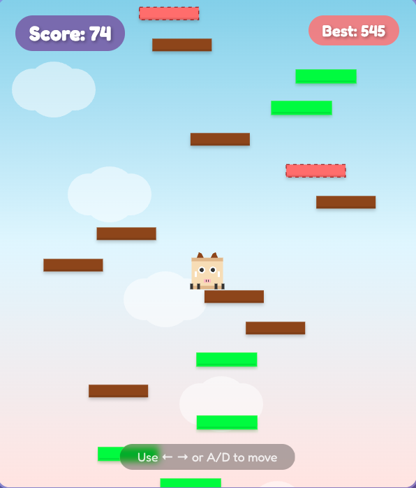

# 🐐 Sky Climb Goat

A fun, vertical jumping game inspired by Go Go Goat where you help a goat climb as high as possible! Built with vanilla JavaScript and HTML5 Canvas.



## 🎮 Play Now

Open `index.html` in your browser to start playing immediately!

## 🎯 Game Features

- **Simple Controls**: Use arrow keys (←→) or A/D to move
- **Multiple Platform Types**:
  - 🟫 **Brown** - Normal platforms
  - 🟢 **Green** - Bouncy platforms (1.5x jump power)
  - 🔴 **Red** - Breaking platforms (single use)
  - 🟡 **Yellow** - Moving platforms
- **Power-ups**:
  - ⚡ **Super Jump** - Jump higher for 3 seconds
  - 🛡️ **Invincibility** - Protection from enemies for 5 seconds
- **Enemies**: Avoid red demons that patrol the platforms
- **Score System**: Track your height and beat your high score
- **Smooth Physics**: Carefully tuned for optimal gameplay
- **Visual Effects**: Particle effects, animations, and dynamic backgrounds

## 🕹️ How to Play

1. Click "Start Game" to begin
2. Use arrow keys or A/D to move left and right
3. Land on platforms to jump higher
4. Avoid enemies (red demons)
5. Collect power-ups for temporary abilities
6. Try to climb as high as possible!

## 🎨 Game Mechanics

### Platform Types
- **Normal (Brown)**: Standard jump height
- **Bouncy (Green)**: Gives 50% more jump power with visual feedback
- **Breaking (Red)**: Breaks after one use - jump quickly!
- **Moving (Yellow)**: Moves horizontally - time your jumps

### Power-ups
- **Super Jump** (Purple Lightning): Temporarily increases jump height
- **Invincibility** (Cyan Shield): Makes you immune to enemies

### Scoring
- Score increases based on height climbed
- High score is saved locally in your browser

## 🛠️ Technical Details

- **Pure JavaScript**: No frameworks or libraries required
- **HTML5 Canvas**: Hardware-accelerated graphics
- **Responsive Design**: Adapts to different screen sizes
- **Local Storage**: Persistent high score tracking
- **60 FPS**: Smooth gameplay experience

## 🎮 Controls

| Key | Action |
|-----|--------|
| ← / A | Move Left |
| → / D | Move Right |
| ESC | Pause (if implemented) |

## 📁 File Structure

```
go-go-game/
├── index.html      # Main game page
├── game.js         # Game logic and mechanics
├── README.md       # This file
└── test.html       # Test page for debugging
```

## 🚀 Development

### Running Locally
1. Clone the repository
2. Open `index.html` in a modern web browser
3. No build process or dependencies required!

### Customization
You can easily modify game parameters in `game.js`:
- `jumpPower`: Adjust jump height
- `gravity`: Change falling speed
- `speed`: Modify horizontal movement speed
- Platform spawn rates and enemy frequency

## 🌟 Features to Add
- [ ] Sound effects and background music
- [ ] More enemy types
- [ ] Additional power-ups
- [ ] Leaderboard system
- [ ] Mobile touch controls
- [ ] Different game modes
- [ ] Character customization

## 📝 License

This project is open source and available for anyone to use and modify.

## 🙏 Credits

Inspired by the mobile game Go Go Goat and classic vertical jumping games.

---

Made with ❤️ using vanilla JavaScript and HTML5 Canvas

**Enjoy climbing! 🐐🚀**